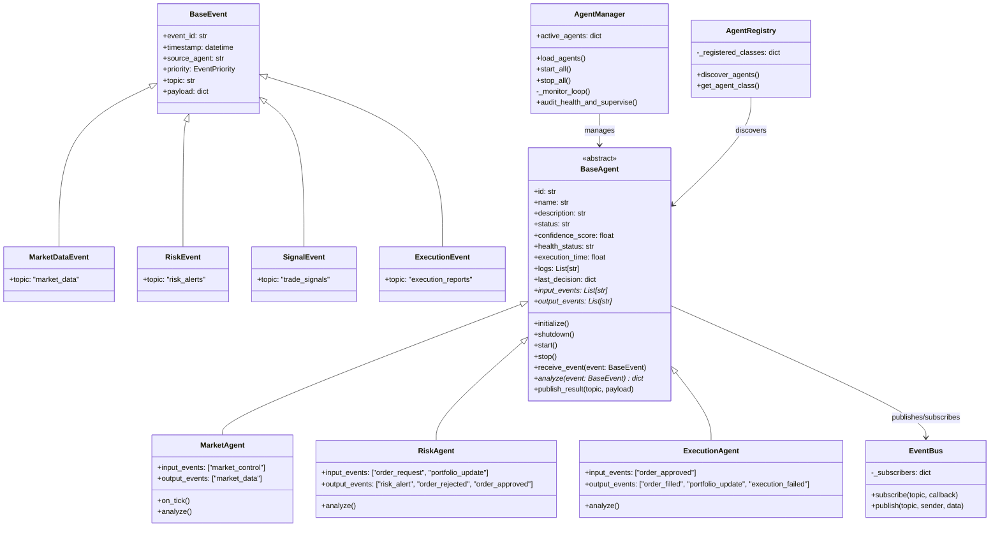
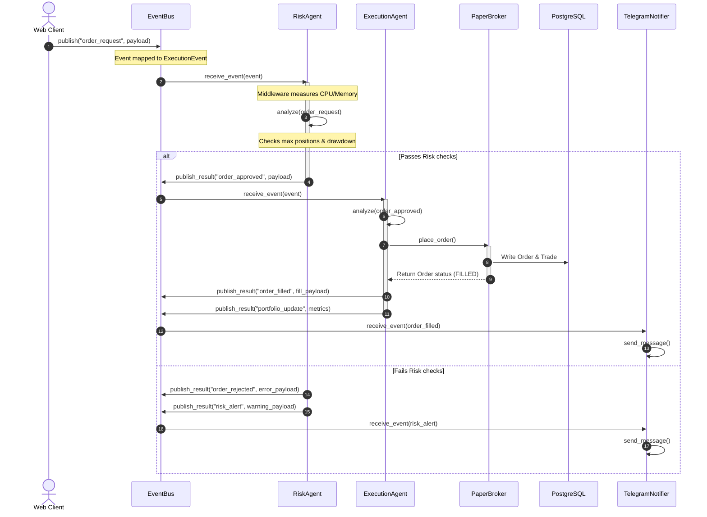

# SPV Quantum AI - AI Agent Framework

This document outlines the design, execution sequence, communication flows, and telemetry logging configurations for the reusable **AI Agent Framework** within SPV Quantum AI.

---

## 1. Class Diagram

The framework relies on a common `BaseAgent` abstract class and a structured `BaseEvent` model class.



---

## 2. Sequence Diagram

The sequence below traces the event flows during a trade order evaluation and execution.



---

## 3. Communication Flow

All messages are represented as JSON strings. Every event generated by an agent conform to:

```json
{
  "event_id": "9b1deb4d-3b7d-4bad-9bdd-2b0d7b3dcb6d",
  "timestamp": "2026-07-04T05:15:30.123456+00:00",
  "source_agent": "risk_agent",
  "priority": "HIGH",
  "topic": "risk_alerts",
  "payload": {
    "alert_type": "LIMIT_EXCEEDED",
    "message": "Estimated cost $12000.00 exceeds limit $10000.00",
    "order_details": {
      "symbol": "BTCUSD",
      "side": "BUY",
      "quantity": 0.2,
      "price": 60000.0
    }
  }
}
```

---

## 4. API Design

### `GET /api/agent_stats`
Returns detailed running metrics for all instantiated agents under the supervisor manager.

#### Sample Response Payload:
```json
{
  "risk_agent": {
    "id": "67324fa6-3729-450f-a9cb-3126fa2c5cf3",
    "description": "Performs risk audits on incoming orders using maximum margin limits",
    "status": "RUNNING",
    "health": "HEALTHY",
    "confidence_score": 100.0,
    "execution_time_ms": 1.23,
    "last_decision": {
      "agent": "risk_agent",
      "approved": true,
      "confidence": 100.0,
      "reason": "Passes all risk parameters."
    },
    "input_events": [
      "order_request",
      "portfolio_update"
    ],
    "output_events": [
      "risk_alert",
      "order_rejected",
      "order_approved"
    ],
    "logs": [
      "[2026-07-04 05:20:00.123] [INFO   ] Agent initialized.",
      "[2026-07-04 05:20:00.124] [INFO   ] Agent started.",
      "[2026-07-04 05:20:05.512] [INFO   ] Processed event 'order_request' in 1.23ms | Process CPU: 0.1% | Memory Delta: 0.0MB"
    ]
  }
}
```
