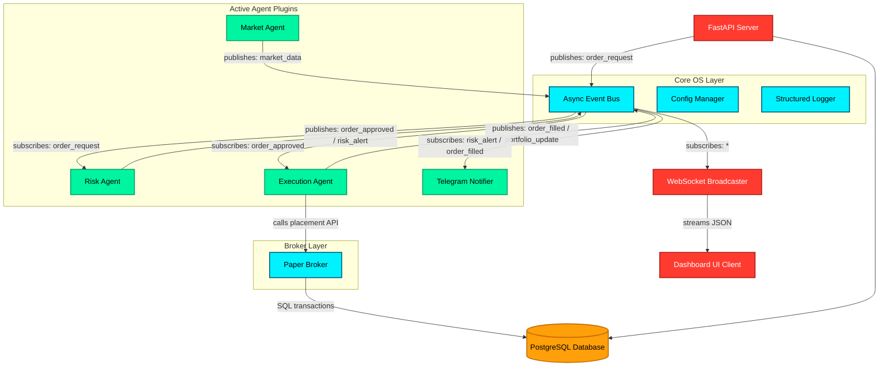

# SPV Quantum AI - System Architecture

This document outlines the foundation, event-driven agent model, database schemas, and API definitions of the **SPV Quantum AI Trading Operating System**.

---

## 1. System Architecture Diagram

The system operates on an asynchronous in-process event-driven architecture. Agents are completely decoupled and interact solely via topic-based publish/subscribe mechanisms on the event bus.



---

## 2. Directory Structure

```
spv-quantum-ai/
├── core/               # System foundation (Event Bus, Base Agent, config, logging)
├── agents/             # Decoupled agent plugins (Market, Risk, Execution, Telegram)
├── database/           # PostgreSQL ORM connection mappings and model schemas
├── brokers/            # Multi-broker client abstractions
├── dashboard/          # FastAPI web interface and WebSocket channels
│   ├── static/         # Frontend scripts (js) and styling (css)
│   └── templates/      # HTML visual screens
├── telegram/           # Telegram client integration
├── config/             # YAML settings configuration templates
├── strategies/         # Strategy execution modules (Reserved)
├── execution/          # Direct exchange execution adapters (Reserved)
├── risk/               # Custom pre-trade risk controls (Reserved)
├── market/             # Live exchange feeds (Reserved)
├── backtest/           # Historical simulation engine (Reserved)
├── paper/              # Local virtual sandbox (Reserved)
├── learning/           # ML/AI learning scripts (Reserved)
├── logs/               # Application log output directory
├── tests/              # Automated unit tests
└── docs/               # System architecture documentation
```

---

## 3. Database Schema

Tables map to standard PostgreSQL relations using SQLAlchemy 2.0 ORM bindings:

### 3.1 Configurations (`configurations`)
Used to modify system configurations without restarting tasks.
- `key` (String, PK): Configuration token.
- `value` (String): Configuration value.
- `description` (String): Annotation.
- `updated_at` (DateTime): Update timestamp.

### 3.2 Market Data (`market_data`)
Stores asset metrics (ticks or candles).
- `id` (Integer, PK, Autoincrement)
- `symbol` (String, Indexed)
- `timestamp` (DateTime, Indexed)
- `interval` (String): e.g. "tick", "1m", "5m", "1d".
- `open` / `high` / `low` / `close` (Float)
- `volume` (Float)

### 3.3 Technical Indicators (`indicators`)
Stores calculated signals (MACD, RSI, customized ML indicators).
- `id` (Integer, PK, Autoincrement)
- `symbol` (String, Indexed)
- `name` (String, Indexed): Indicator model name.
- `timestamp` (DateTime, Indexed)
- `values` (JSON): Mapped signal values.

### 3.4 Orders (`orders`)
- `id` (String, PK): Client-generated unique token.
- `broker_order_id` (String, Indexed)
- `symbol` (String, Indexed)
- `side` (String): "BUY" / "SELL".
- `type` (String): "LIMIT" / "MARKET" / "SL".
- `price` (Float)
- `quantity` (Float)
- `status` (String, Indexed): "PENDING", "FILLED", "CANCELLED", "REJECTED".
- `broker` (String): Target broker identity.
- `created_at` / `updated_at` (DateTime)

### 3.5 Trades (`trades`)
- `id` (String, PK): Unique execute fill ID.
- `order_id` (String, FK -> `orders.id`, Indexed)
- `symbol` (String, Indexed)
- `side` (String)
- `price` / `quantity` / `commission` (Float)
- `executed_at` (DateTime, Indexed)
- `broker` (String)

### 3.6 Agent Reports (`agent_reports`)
- `id` (Integer, PK)
- `agent_name` (String, Indexed)
- `report_type` (String, Indexed): e.g. "drawdown", "heartbeat".
- `data` (JSON): Custom metadata report dict.
- `created_at` (DateTime, Indexed)

### 3.7 Journal Diary (`journal`)
- `id` (Integer, PK)
- `entry_type` (String, Indexed): e.g., "manual_note", "risk_cooldown".
- `text` (String): Free text description.
- `tags` (JSON): Array of tags.
- `created_at` (DateTime)

### 3.8 Performance (`performance`)
- `id` (Integer, PK)
- `equity` / `pnl` / `drawdown_percent` / `sharpe_ratio` (Float)
- `metrics` (JSON): Dict containing transaction counts, profit factor, etc.
- `timestamp` (DateTime, Indexed)

---

## 4. API Endpoints Reference

| Method | Endpoint | Description | Payload / Response |
| :--- | :--- | :--- | :--- |
| **GET** | `/` | Serves Glassmorphic Web Dashboard | HTML Document |
| **GET** | `/api/status` | Current runtime status & active agents | System JSON metadata |
| **GET** | `/api/orders` | Query database orders history | Array of order records |
| **GET** | `/api/trades` | Query database executed fills history | Array of trade records |
| **POST** | `/api/order` | Place order request to core engine | `{"symbol": str, "side": str, "quantity": float, "price": float, "type": str}` |
| **WS** | `/ws` | Real-time WebSocket event broadcaster | Streaming events (ticks, log events, status fills) |

---

## 5. Implementation Roadmap

### Phase 1: Core Foundation (Current)
- [x] Directory layouts & packaging configuration.
- [x] Asynchronous Event Bus communication module.
- [x] Dynamically loadable Agent architecture interface.
- [x] Structured JSON logger & config manager.
- [x] PostgreSQL schemas and models mapping.
- [x] FastAPI REST routing & WebSocket streaming channels.
- [x] Glassmorphic responsive monitoring UI.
- [x] Dockerfile container packaging and Docker Compose configurations.

### Phase 2: Live Connections & Broker Integration
- [ ] Connect Telegram Bot for inbound manual controls.
- [ ] Implement live exchange WebSockets (e.g. Kotak Securities API, Binance API) under `market/` directory.
- [ ] Build concrete broker adapters inside `brokers/` layer with live auth signatures.

### Phase 3: Strategy Engine & Risk Safeguards
- [ ] Implement technical indicators calculations using Ta-Lib or pandas.
- [ ] Structure strategy agents subclassing `BaseAgent` inside `strategies/` directory.
- [ ] Create detailed execution slices (TWAP, VWAP) under `execution/` directory.
- [ ] Incorporate hard circuit breakers (Max slippage, order rate limits) under `risk/`.

### Phase 4: Backtesting & Dry-Run Sandbox
- [ ] Connect `backtest/` parser to load historical ticks from `market_data` table.
- [ ] Run dry tests inside `paper/` using simulated execution latency.
- [ ] Launch ML parameter optimization engines in `learning/`.
